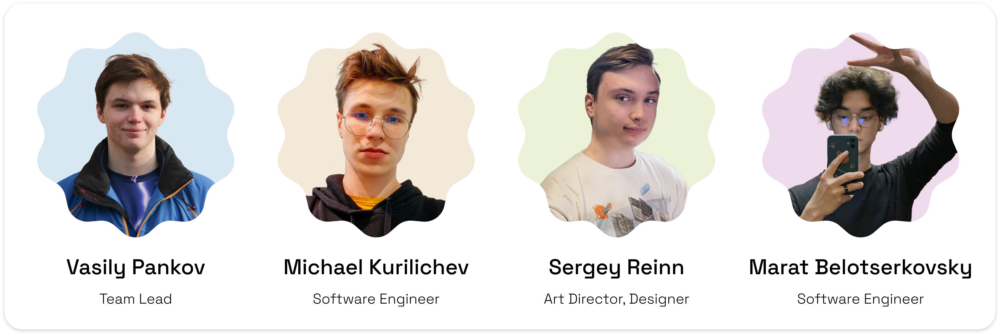

<h1>
  
  Лефтбрейнед
</h1>

> ### IT-проекты *просто и доступно* для всех

**Привет!** Если вы ищете команду, которая возьмёт на себя весь IT-проект от А до Я, то вы попали точно по адресу. Наша задача — превратить вашу идею в успешный бизнес. Не важно, насколько сырая или разработанная ваша концепция — мы поможем ей взлететь.

> [!NOTE]
> Лефтбрейнед предлагает **полный спектр услуг**: от разработки концепции и дизайна бренда, до разработки приложения или сайта, который реально будет полезен — будь то нейросетевой стартап, шиномонтажный салон или ювелирный магазин. Хотите просто заменить свой старый логотип или запустить глобальную рекламную кампанию? Мы на месте!

Наш подход — это не просто отдельные услуги для бизнеса, а полноценное партнёрство. Мы вместе с вами пройдём путь от первой встречи до запуска проекта. Будем рядом на каждом этапе, обсудим все детали и предложим оптимальные решения. Ваш успех — наша главная цель.

## Проекты с *душой и характером*

В каждый проект мы вкладываем часть себя: нашу страсть, мастерство и индивидуальный подход. С гордостью демонстрируем некоторые из них:

- [Multimark](https://github.com/Leftbrained-Inc/multimark) — Текстовый редактор Markdown в стиле Material Design 3
- [uptask](https://github.com/bulkabuka/UptaskApp) — планировщик задач на Android с фокусом на локальность и приватность
- [Emojity](https://github.com/bulkabuka/Emojity) — веб-приложение, позволяющее создавать аватарки из эмодзи с цветным фоном
- [Yandex Music 3](https://github.com/pank-su/YandexMusic3) — альтернативный кроссплатформенный клиент для Яндекс.Музыки

... и еще много другого!

## Команда

Познакомьтесь с нашей командой: это профессионалы, которые стоят за каждым нашим проектом. Каждый вносит свой вклад в то, чтобы ваши идеи оживали.

## Контакты

Свяжитесь с нами через email: team@leftbrained.space, или через Telegram: [@leftbrained_inc](https://leftbrained_inc.t.me)

[EN version](README_en.md)
